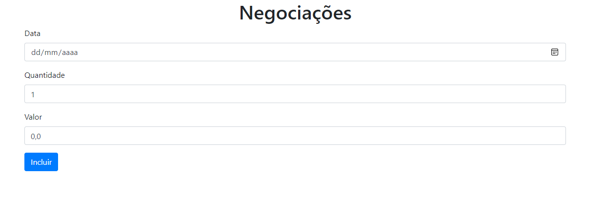

# Alura Frame TSC 

**Esta aplicação web é a versão atualizada do alura frame feita antigamente em JS puro, e agora utilizamos o modelo MVC parecido, porém agora em TypeScript, com tipagem de valores e variáveis, método getters, contructor, objetos e classes, passando por uma modelo de negociação web**

---
